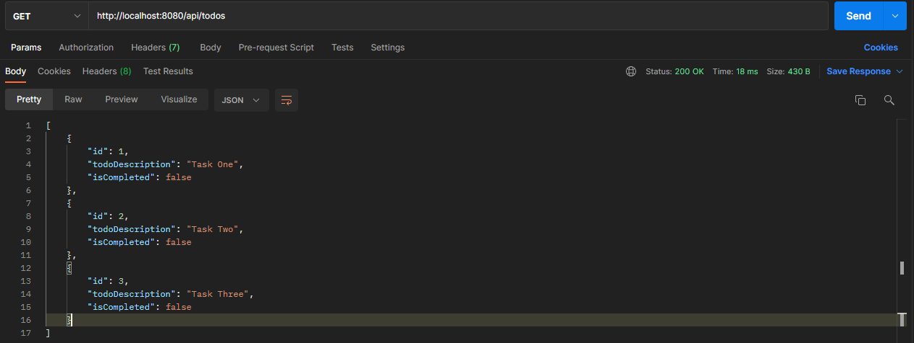
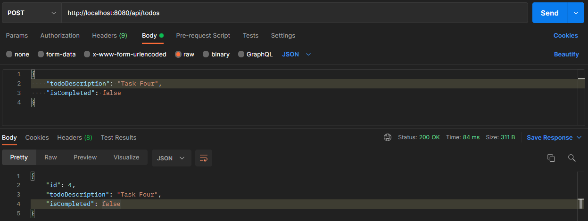
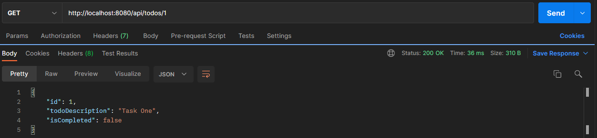
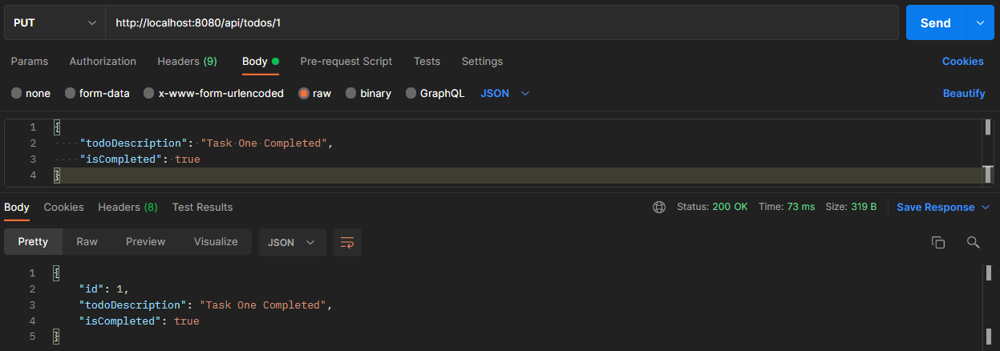
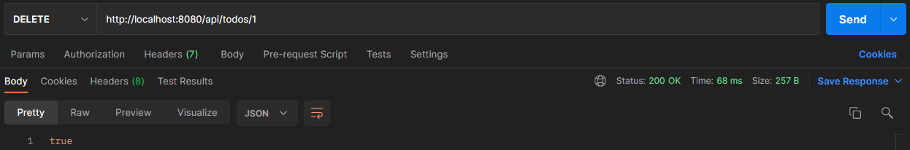

# Sofka To-Do Challenge Two

This is a to-do application which has an API made with Spring Boot and is consumed from a frontend created with React.

# Repository from challenge one

https://github.com/JuanWebDeveloper/Todo-App

# Challenge to develop

For this challenge we were asked to develop an application with the interface from challenge one, but instead of the actions for the crud being synchronous storing the to-dos in LocalStorage the actions will be asynchronous consuming an API developed with Spring Boot that It will take care of performing all the necessary actions for the crud of the application and at the same time all the tasks will be stored in a mysql database.

In a few words it is an application developed with React that in order to carry out all the necessary actions for the crud of the application requests are made to an API to consume the information it returns when executing its respective methods.

# How API requests work

Next some screenshots were attached to this document where the correct functioning of the api can be evidenced.

## Request for get all tasks

## Request to save tasks

## Request to get a task by its id

## Request to update tasks

## Request to delete the tasks

# Application Demo

